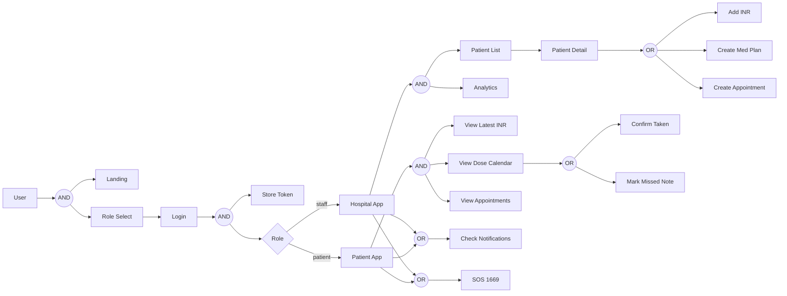

  # Warfarin Care web application

  This is a code bundle for Warfarin Care web application. The original project is available at https://www.figma.com/design/uF4Tprn3el0wtyCzcORHza/Warfarin-Care-web-application.

  ## Running the code

  Run `npm i` to install the dependencies.

  Run `npm run dev` to start the development server.
  
## System Flow (Frontend)

